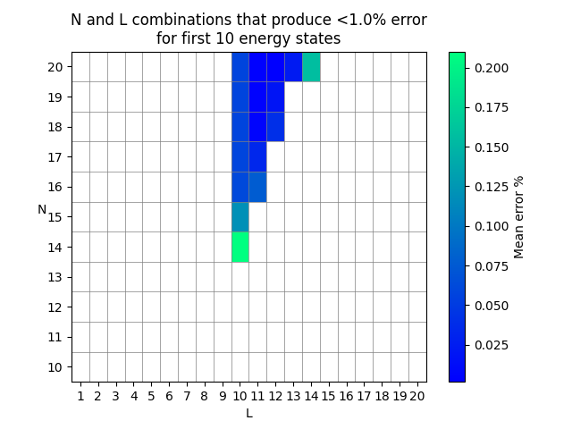

# Harmonic Approximator

- [Main program](#main-program)
- [N vs. L plot](#n-vs-l-plot)
- [Mathematics behind code](#mathematics-behind-code)
  * [Start of the eigenvalue equation](#start-of-the-eigenvalue-equation)
  * [Solving kinetic and potential energy integral](#solving-kinetic-and-potential-energy-integral)
  * [Eigenvalue equation as matrix equation](#eigenvalue-equation-as-matrix-equation)
  * [Kinetic energy matrix](#kinetic-energy-matrix)
  * [Potential energy matrix](#potential-energy-matrix)
    + [Potential energy integral as sum](#potential-energy-integral-as-sum)
    + [The S matrix](#the-s-matrix)
  * [Eigenvalue equation summary](#eigenvalue-equation-summary)
  * [Finding eigenenergies](#finding-eigenenergies)

## Main program
The program `harmonic_approximator.py` approximates the $K \geq 1$ first energies of the Harmonic Oscillator:

```math
    V(x) = \frac{1}{2} M \omega^2 x^2
```

where $M = 1$ and $\omega = 1$ in atomic units.

The approximation is done by using the first $N \geq K$ known eigenfunctions of the Infinite Square Well of length $L$:

```math
    \phi_n(x) = \sqrt{\frac{2}{L}} \sin\left(\frac{\pi}{L}nx\right)
```

Example of how to run the program with $K=10$, $N=17$  and $L=11$, where we use `P=19` amount of points between $0$ and $L$ for the numerical integration:

```bash
python harmonic_approximator.py -K 10 -N 17 -L 11 -P 19
```

Output:
```

                 K = 10 | N = 17 | L = 11.0

|  State | Actual Energy | Approximate Energy |   Error %  |
|--------|---------------|--------------------|------------|
| n =  1 |           0.5 |         0.50000000 |    0.00000 |
| n =  2 |           1.5 |         1.50000000 |    0.00000 |
| n =  3 |           2.5 |         2.50000000 |    0.00000 |
| n =  4 |           3.5 |         3.50000071 |    0.00002 |
| n =  5 |           4.5 |         4.50000105 |    0.00002 |
| n =  6 |           5.5 |         5.50006228 |    0.00113 |
| n =  7 |           6.5 |         6.50007180 |    0.00110 |
| n =  8 |           7.5 |         7.50208028 |    0.02774 |
| n =  9 |           8.5 |         8.50218462 |    0.02570 |
| n = 10 |           9.5 |         9.52911177 |    0.30644 |

```

## N vs. L plot 

The additional program `N_vs_L.py` plots a graph showing good combinations of $N$ and $L$.

Example of how to run the program with $K=10$, where we check all combinations of $N \in [K, 50]$ and $L \in [1, 35]$ (with `dL = 0.1` between all $L$ values) that gives all first $K$ energies with less than `E = 1.0` % error. Higher values of $L$ generally requires higher integration precision, so we have here set `P=200`.

```bash
python.exe N_vs_L.py -K 10 -N 50 -L 35 -P 200 -dL 0.1 -E 1.0
```

Output:



## Mathematics behind code

NOTE: GitHub does not have the best rendered for LaTeX. I reccomend viewing this in VSCode's markdown previewer.

We assume we can express the wavefunction of the Harmonic Oscillator $\psi$ in a 
basis spanned by the solutions $\phi_n$ to the TISE of the Infinite Square Well:

```math
    \psi(x) = \sum_n a_n \phi_n
```

We are essentially imagining that we are placing the Harmonic Oscillator potential in the middle of a Infinite Square Well potential.

### Start of the eigenvalue equation

Putting this into the TISE gives

```math
\begin{align*}
    \mathrm{H}\psi &= E\psi \\
    \mathrm{H}\sum_n a_n \phi_n &= E\sum_n a_n \phi_n \\
    \sum_n a_n \mathrm{H}\phi_n &= E\sum_n a_n \phi_n
\end{align*}
```

We then multiply both sides by the complex conjugate of an arbitrary solution to the TISE of the Infinte Square Well (denoted by $\phi_m^*$ where $m \neq n$):

```math
\begin{align*}
    \phi_m^*\sum_n a_n \mathrm{H}\phi_n &= \phi_m^*E\sum_n a_n \phi_n  \\
    \sum_n a_n \phi_m^*\mathrm{H}\phi_n &= E\sum_n a_n \phi_m^*\phi_n
\end{align*}
```

We then integrate both sides with respect to position $x$, from $x=0$ to $x = L$:

```math
\begin{align*}
    \int_0^L\left(\sum_n a_n \phi_m^*\mathrm{H}\phi_n\right) dx &= \int_0^L \left(E\sum_n a_n \phi_m^*\phi_n \right) dx \\
    \sum_n a_n \int_0^L\phi_m^*\mathrm{H}\phi_n dx &= E\sum_n a_n \int_0^L\phi_m^*\phi_n dx
\end{align*}
```

Since $\phi_n$ and $\phi_n$ are different solutions to the TISE of the Infinite Square Well, the we have that $\int_0^L\phi_m^*\phi_n dx = \delta_{m n}$, thus we have

```math
    \sum_n a_n \int_0^L\phi_m^*\mathrm{H}\phi_n dx = E a_m
```

The Hamiltonian operator kan be written as the sum of the kinetic energy operator $\mathrm{T}$ and the potential energy operator $\mathrm{V}$, thus:

```math
    \sum_n a_n \left(\int_0^L\phi_m^*\mathrm{T}\phi_n dx + \int_0^L\phi_m^*\mathrm{V}\phi_n dx\right) = E a_m
```

### Solving kinetic and potential energy integral

Let's solve the kinetic energy integral

```math
\begin{align*}
    \int_0^L \phi_m^* \mathrm{T}\phi_n dx &= \int_0^L\phi_m^*\left(-\frac{\hbar^2}{2M}\frac{\partial^2}{\partial x^2}\right)\phi_n dx \\
    &= -\frac{\hbar^2}{2M} \int_0^L\phi_m^*\frac{\partial^2}{\partial x^2}\phi_n dx \\
    &= -\frac{\hbar^2}{2M} \int_0^L\sqrt{\frac{2}{L}} \sin\left(\frac{\pi}{L}mx\right)\frac{\partial^2}{\partial x^2}\sqrt{\frac{2}{L}} \sin\left(\frac{\pi}{L}nx\right) dx \\
    &= -\frac{\hbar^2}{2M} \int_0^L\sqrt{\frac{2}{L}} \sin\left(\frac{\pi}{L}mx\right)\left(-\frac{\pi^2}{L^2}n^2\right)\sqrt{\frac{2}{L}} \sin\left(\frac{\pi}{L}nx\right) dx \\
    &= \frac{\hbar^2 \pi^2}{2ML^2}n^2 \int_0^L\sqrt{\frac{2}{L}} \sin\left(\frac{\pi}{L}mx\right)\sqrt{\frac{2}{L}} \sin\left(\frac{\pi}{L}nx\right) dx \\
    &= \frac{\hbar^2 \pi^2}{2ML^2}n^2 \int_0^L \phi_m^* \phi_n dx \\
    &= \frac{\hbar^2 \pi^2}{2ML^2}n^2 \delta_{m n}
\end{align*}
```

Now, let's solve the potential energy integral. Note that we assume that the Harmonic Oscillator potential is placed in the middle of the Infinite Square Well potential, this the potential energy operator becomes:

```math
    \mathrm{V} = V(x) = \frac{1}{2}M\omega^2(x - L/2)^2
```

Thus, the integral equals

```math
\begin{align*}
    \int_0^L\phi_m^*\mathrm{V}\phi_n dx &= \int_0^L\phi_m^*\left(\frac{1}{2}M\omega^2(x - L/2)^2\right)\phi_n dx \\
    &= \frac{1}{2}M\omega^2\int_0^L\phi_m^*(x - L/2)^2\phi_n dx \\
    &= \frac{1}{2}M\omega^2\int_0^L\sqrt{\frac{2}{L}} \sin\left(\frac{\pi}{L}mx\right)\sqrt{\frac{2}{L}} \sin\left(\frac{\pi}{L}nx\right) (x - L/2)^2 dx \\
    &= \frac{M\omega^2}{L}\int_0^L\sin\left(\frac{\pi}{L}mx\right)\sin\left(\frac{\pi}{L}nx\right) (x - L/2)^2 dx
\end{align*}
```

Further than that is borderline impossible to do analytically. This the integral has to be solved numerically. More on that later.

### Eigenvalue equation as matrix equation

Let's define the integral values as such

```math
\begin{align*}
    T_{mn} &= \frac{\hbar^2 \pi^2}{2ML^2}n^2 \delta_{m n} \\
    V_{mn}&=\frac{M\omega^2}{L}\int_0^L\sin\left(\frac{\pi}{L}mx\right)\sin\left(\frac{\pi}{L}nx\right) (x - L/2)^2 dx
\end{align*}
```

Since we are using atomic units ($\hbar = 1$) and we have that $M=1$ and $\omega = 1$, these simplify to 

```math
\begin{align*}
    T_{mn} &= \frac{\pi^2}{2L^2}n^2 \delta_{m n} \\
    V_{mn}&=\frac{1}{L}\int_0^L\sin\left(\frac{\pi}{L}mx\right)\sin\left(\frac{\pi}{L}nx\right) (x - L/2)^2 dx
\end{align*}
```

Our TISE has now gone from this

```math
    \mathrm{H}\sum_n a_n \phi_n = E\sum_n a_n \phi_n
```

To this

```math
    \sum_n (T_{mn} + V_{mn})a_n = Ea_m
```

The index $m$ came from a arbitrary solution to the TISE of the Infinte Square Well. Now, there are literally infinite solutions to the TISE of the Infinte Square Well, so we actually have infinitely many such equations:

```math
\begin{align*}
    \sum_n (T_{1n} + V_{1n})a_n &= Ea_1 \\
    \sum_n (T_{2n} + V_{2n})a_n &= Ea_2 \\
    \sum_n (T_{3n} + V_{3n})a_n &= Ea_3 \\
    &\vdots
\end{align*}
```

If we were the summations fully out, we would have

```math
\begin{align*}
    (T_{11} + V_{11})a_1 + (T_{12} + V_{12})a_2 + \cdots &= Ea_1 \\
    (T_{21} + V_{21})a_1 + (T_{22} + V_{22})a_2 + \cdots&= Ea_2 \\
    (T_{31} + V_{31})a_1 + (T_{32} + V_{32})a_2 + \cdots&= Ea_3 \\
    &\vdots
\end{align*}
```

This can actually be express as a matrix equation! Let's define $\mathbf{T}$ as the matrix whose components are $T_{mn}$, and $\mathbf{V}$ as the matrix whose components are $V_{mn}$. 

We can now express the previous equation as

```math
    (\mathbf{T} + \mathbf{V})\mathbf{a} = E\mathbf{a}
```

where $\mathbf{a}$ is a column vector whose components are $a_1$, $a_2$, $a_3$, ...

_Important to note! The value $m$ thus represents the row number index in the matrix sum, and the number $n$ represents the column number in the matrix sum._

### Kinetic energy matrix

The $\mathbf{T}$ matrix can actually be expressed more simply. Since its components are

```math
    T_{mn} = \frac{\pi^2}{2L^2}n^2 \delta_{m n}
```

we know that whenever $m \neq n$ it's zero. So, $\mathbf{T}$ has non-zero values only along its diagonal where $m = n$. Thus, we have

```math
    \mathbf{T} = \mathrm{diag}(\mathbf{t})
```

where $\mathbf{t}$ is vector whose $n$-th component is 

```math
    \frac{\pi^2}{2L^2}n^2
```

Thus we can write

```math
    (\mathrm{diag}(\mathbf{t}) + \mathbf{V})\mathbf{a} = E\mathbf{a}
```

### Potential energy matrix

Unfortunately, the elements of the matrix $\mathbf{V}$ are extremely hard to do analytically due to the insane integral

```math
    V_{mn} = \frac{M\omega^2}{L}\int_0^L\sin\left(\frac{\pi}{L}mx\right)\sin\left(\frac{\pi}{L}nx\right) (x - L/2)^2 dx
```

#### Potential energy integral as sum

What we can do, is to approximate the integral as a Riemann sum. The best basic Riemann sum is that which uses the "midpoint rule" (i.e. it uses the midpoint value in each sub interval).

Let $\Delta x$ be the width of each sub-interval from $0$ to $L$ used in the Riemann sum. We then define the column vector $\mathbf{x}$ whose $i$-th component is 

```math
    x_i = (2i - 1)\frac{\Delta x}{2}
```

In other words, $\mathbf{x}$ contains all the midpoints of each sub-interval. Note that $\mathbf{x}$ is finite, and its last value is $L - \frac{\Delta x}{2}$.

We can now approximate the integral as the sum

```math
    V_{mn} \approx \frac{M\omega^2}{L} \sum_i\left[\sin\left(\frac{\pi}{L}mx_i\right)\sin\left(\frac{\pi}{L}nx_i\right) (x_i - L/2)^2\right]\Delta x
```

Okay, that should be easy to implement in code with a nested for-loop, however, that would not utilize our computation power to its fullest. In the world of computation, matrices and vectors are the kings and queens when it comes to performance. So let's give the computer the food it loves!

#### The S matrix

If we had a matrix $\mathbf{S}$ whose elements were

```math
    \mathbf{S}[i, j] = \sin\left(\frac{\pi}{L}jx_i\right)(x_i - L/2)
```

then, the matrix product $\mathbf{P} = \mathbf{S}^\mathrm{T}\,\mathbf{S}$ would have elements

```math
    \mathbf{P}[m, n] = P_{mn} = \sum_i\left[\sin\left(\frac{\pi}{L}mx_i\right)\sin\left(\frac{\pi}{L}nx_i\right) (x_i - L/2)^2\right]
```

which is our Riemann sum! 

It may be a bit hard to wrap your head around the matrix multiplication here, so let's try to explain it. 

When we do matrix multiplication, we dot the row of the first matrix with the column of the second matrix. 

The first $m$-th row of first matrix ($\mathbf{S}^\mathrm{T}$) is

```math
    \sin\left(\frac{\pi}{L}mx_1\right)(x_1 - L/2) \\
    \sin\left(\frac{\pi}{L}mx_2\right)(x_2 - L/2) \\
    \sin\left(\frac{\pi}{L}mx_3\right)(x_3 - L/2) \\
    \vdots
```

The first $n$-th column of second matrix ($\mathbf{S}$) is

```math
    \sin\left(\frac{\pi}{L}nx_1\right)(x_1 - L/2) \\
    \sin\left(\frac{\pi}{L}nx_2\right)(x_2 - L/2) \\
    \sin\left(\frac{\pi}{L}nx_3\right)(x_3 - L/2) \\
    \vdots
```

Thus when dotting them, we get

```math
    \sin\left(\frac{\pi}{L}mx_1\right)(x_1 - L/2)\sin\left(\frac{\pi}{L}nx_1\right)(x_1 - L/2) \\
    + \\
    \sin\left(\frac{\pi}{L}mx_2\right)(x_2 - L/2)\sin\left(\frac{\pi}{L}nx_2\right)(x_2 - L/2) \\
    + \\
    \sin\left(\frac{\pi}{L}mx_3\right)(x_3 - L/2)\sin\left(\frac{\pi}{L}nx_3\right)(x_3 - L/2) \\
    \vdots
```

Or, written more simply:

```math
    \sum_i\left[\sin\left(\frac{\pi}{L}mx_i\right)\sin\left(\frac{\pi}{L}nx_i\right) (x_i - L/2)^2\right]
```

Okay, let's finally find a expression for the potential energy matrix. We have that the elements of $\mathbf{V}$ are approximated to

```math
    V_{mn} \approx \frac{M\omega^2}{L} \sum_i\left[\sin\left(\frac{\pi}{L}mx_i\right)\sin\left(\frac{\pi}{L}nx_i\right) (x_i - L/2)^2\right]\Delta x
```

_Note that this means our approximation of $\mathbf{V}$ is **symmetric**. Since changing $m$ and $n$ does not change the value, thus $V_{mn} = V_{nm}$._

The sum in the middle is equal to the $mn$-th element of $\mathbf{P} = \mathbf{S}^\mathrm{T}\,\mathbf{S}$ as we just showed, so we can write

```math
    V_{mn} \approx \frac{M\omega^2}{L} P_{mn}\Delta x
```

Which is the same as writing

```math
    \mathbf{V} \approx \frac{M\omega^2}{L} \cdot \mathbf{P} \cdot \Delta x  \\
    \mathbf{V} \approx \frac{M\omega^2}{L} \cdot \mathbf{S}^\mathrm{T}\,\mathbf{S} \cdot \Delta x  \\
```

Great! But, we still need to know how to construct the matrix $\mathbf{S}$. We have that 

```math
    \mathbf{S}[i, j] = \sin\left(\frac{\pi}{L}jx_i\right)(x_i - L/2)
```

to construct a matrix like this, we can write

```math
    \mathbf{S} = \sin\left(\frac{\pi}{L} \begin{bmatrix}
           x_{1} \\
           x_{2} \\
           \vdots \\
         \end{bmatrix}
         \begin{bmatrix}
           1 &
           2 &
           \cdots &
         \end{bmatrix}\right)
    *
    \begin{bmatrix}
           x_{1} - L/2 \\
           x_{2} - L/2 \\
           \vdots \\
         \end{bmatrix}
```

What we do here is essentially first constructing the matrix

```math
\frac{\pi}{L}
\begin{bmatrix}
           x_{1} \\
           x_{2} \\
           \vdots \\
         \end{bmatrix}
         \begin{bmatrix}
           1 &
           2 &
           \cdots &
         \end{bmatrix}
    =
\begin{bmatrix}
\frac{\pi}{L}1x_{1} & \frac{\pi}{L}2x_{1} & \cdots \\
\frac{\pi}{L}1x_{2} & \frac{\pi}{L}2x_{2} & \cdots \\
\vdots & \vdots & \ddots
\end{bmatrix}
```

Then we take the sine of every element in that matrix and create a new matrix

```math
    \begin{bmatrix}
    \sin(\frac{\pi}{L}1x_{1}) & \sin(\frac{\pi}{L}2x_{1}) & \cdots \\
    \sin(\frac{\pi}{L}1x_{2}) & \sin(\frac{\pi}{L}2x_{2}) & \cdots \\
    \vdots & \vdots & \ddots
    \end{bmatrix}
```

And then, dot every column with the column vector

```math
    \begin{bmatrix}
           x_{1} - L/2 \\
           x_{2} - L/2 \\
           \vdots \\
         \end{bmatrix}
```

and thus get

```math
    \mathbf{S} = 
    \begin{bmatrix}
    \sin(\frac{\pi}{L}1x_{1})(x_{1} - L/2) & \sin(\frac{\pi}{L}2x_{1})(x_{1} - L/2) & \cdots \\
    \sin(\frac{\pi}{L}1x_{2})(x_{2} - L/2) & \sin(\frac{\pi}{L}2x_{2})(x_{2} - L/2) & \cdots \\
    \vdots & \vdots & \ddots
    \end{bmatrix}
```

### Eigenvalue equation summary

Finally, we can start to conclude this journey. Let's summarize what we have so far

We started with the TISE

```math
    \mathrm{H}\sum_n a_n \phi_n = E\sum_n a_n \phi_n
```

Which we rewrote ass

```math
    (\mathbf{T} + \mathbf{V})\mathbf{a} = E\mathbf{a}
```

Where 

```math
    \mathbf{T} = \mathrm{diag}(\mathbf{t})
```

where $\mathbf{t}$ is vector whose $n$-th component is 

```math
    \frac{\pi^2}{2L^2}n^2
```

And

```math
    \mathbf{V} \approx \frac{M\omega^2}{L} \cdot \mathbf{S}^\mathrm{T}\,\mathbf{S} \cdot \Delta x  \\
```

where $\mathbf{S}$ is a matrix whose $in$-th component is

```math
    \sin\left(\frac{\pi}{L}nx_i\right)(x_i - L/2)
```

and $\Delta x$ is defined such that 

```math
    \Delta x = x_{i+1} - x_{i} \quad \forall i
```

### Finding eigenenergies
If we let the total energy matrix $\mathbf{H}$ be written as the sum of the kinetic energy matrix $\mathbf{T}$ and the potential energy matrix $\mathbf{V}$, we see that we still are looking at a eigenvalue equation

```math
    \mathbf{H} \mathbf{a} = E \mathbf{a} 
```

_Note that $\mathbf{H}$ is hermitian since $\mathbf{T}$ is a diagonal matrix, and $\mathbf{V}$ is symmetric._

Now, what is the size of $\mathbf{H}$? It is theoretically infinite in size, since its dimensions is equal to the amount of wave functions $\phi_n$ that solve the TISE for the Infinite Square well, which is, well, an infinite amount. 

What we can do, is limit the values of $n$ to be in the interval $[1, N]$, where $N$ is some finite positive integer. Thus the size of $\mathbf{H}$ is $N \times N$, and the size of $\mathbf{a}$ is $N \times 1$.

So, we are looking at $N$ eigenvalues of $E$. If, for example, we had $N=2$, our eigenvalue matrix equation would be equal to the equations

```math
\begin{align*}
    \sum_n^2 (T_{1n} + V_{1n})a_n &= E_1a_1 \\
    \sum_n^2 (T_{2n} + V_{2n})a_n &= E_2a_2 \\
\end{align*}
```

and the approximated first energy would be $E_1$, and the approximated second energy would be $E_2$.

Thankfully, effective and performant functions for finding the eigenvalues of matrix eigenvalue equations are implemented in a lot of programming libraries, so we need not worry more about it here. In this code, the function `eigenvalsh()` form the Python module NumPy is used.


