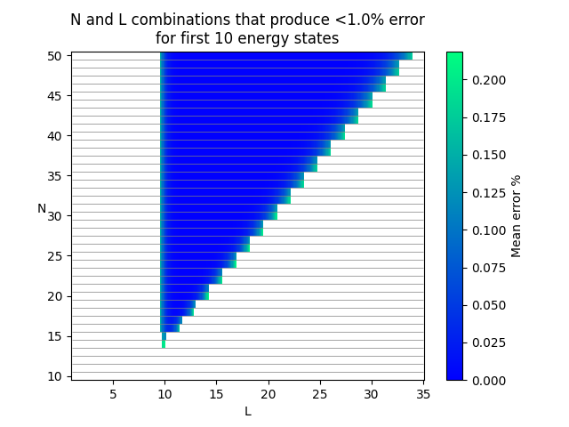

# Harmonic Approximator

Program that approximates the $K \geq 1$ first energies of the Harmonic Oscillator:

$$
    V(x) = \frac{1}{2} m \omega^2 x^2
$$

The approximation is done by using the first $N \geq K$ known eigenfunctions of the Infinite Square Well of length $L$:

$$
    \psi_n(x) = \sqrt{\frac{2}{L}} \sin\left(\frac{\pi}{L}nx\right)
$$

Example of how to run the program with $K=10$, $N=17$  and $L=11$, where we use `P=19` amount of points between $0$ and $L$ for the numerical integration:

```bash
python harmonic_approximator.py -K 10 -N 17 -L 11 -P 19
```

Output:
```

                 K = 10 | N = 17 | L = 11.0

|  State | Actual Energy | Approximate Energy |   Error %  |
|--------|---------------|--------------------|------------|
| n =  1 |           0.5 |         0.50000000 |    0.00000 |
| n =  2 |           1.5 |         1.50000000 |    0.00000 |
| n =  3 |           2.5 |         2.50000000 |    0.00000 |
| n =  4 |           3.5 |         3.50000071 |    0.00002 |
| n =  5 |           4.5 |         4.50000105 |    0.00002 |
| n =  6 |           5.5 |         5.50006228 |    0.00113 |
| n =  7 |           6.5 |         6.50007180 |    0.00110 |
| n =  8 |           7.5 |         7.50208028 |    0.02774 |
| n =  9 |           8.5 |         8.50218462 |    0.02570 |
| n = 10 |           9.5 |         9.52911177 |    0.30644 |

          exec. time: 0.202 ms | numerical prec.: 19

```

## $N$ vs. $L$ plot

The additional program `N_vs_L.py` plots a graph showing good combinations of $N$ and $L$.

Example of how to run the program with $K=10$, where we check all combinations of $N \in [K, 20]$ and $L \in [1, 20]$ that gives all first $K$ energies with less than `E=1.0` % error. Higher values of $L$ generally requires higher integration preccision, so we have here set `P=100`.

*NOTE: The program only uses integer values for $L$*

```bash
python.exe N_vs_L.py -K 10 -N 20 -L 20 -P 100 -E 1.0
```

Output:



## Mathematics behind code

TODO